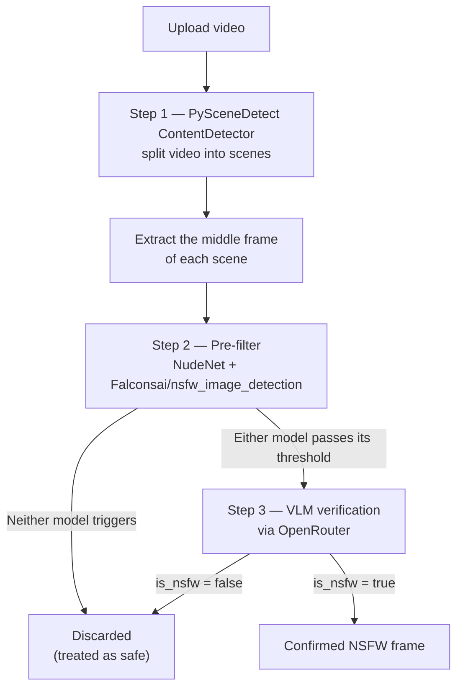

# Video NSFW Detector

A Streamlit web app that scans an uploaded video for NSFW (Not Safe For Work) content using a three-stage moderation pipeline: scene detection, a fast image-classifier pre-filter, and a final vision-language-model (VLM) verification pass on only the flagged frames.

## Pipeline overview



## How it works

The pipeline is designed to minimize false positives and avoid sending every frame to an expensive VLM call.

**Step 1 — Scene detection & frame extraction**
Uses [PySceneDetect](https://www.scenedetect.com/) (`ContentDetector`) to split the video into scenes, then extracts a single representative frame from the middle of each scene (never the very first or last frame of a scene).

`ContentDetector` works by converting each decoded frame to the HSV color space and measuring a weighted difference in hue, saturation, and luminance (plus an optional edge-detection term) against the previous frame. When that combined content-change score crosses the configured `threshold`, a scene cut is registered at that point; the `min_scene_len` parameter then discards any scene shorter than the given number of frames so that noise or very brief flashes don't get counted as real scenes. This detector targets hard cuts between shots rather than slow fades, which fits typical edited video well. Because a hard cut can leave the frame right at a scene boundary blurry or transitional, the app deliberately samples the *middle* frame of each detected scene as the most visually representative one to send downstream.

**Step 2 — Pre-filter with two lightweight classifiers**
Every extracted frame is scored by two independent, fast image classifiers before anything is sent to the (slower, costlier) VLM:
- **[NudeNet](https://github.com/notAI-tech/NudeNet)** — an object-detection model that locates specific body regions in an image and returns bounding boxes with class labels (e.g. exposed breast/genitalia/buttocks/anus) and confidence scores. This app only looks at the explicit "exposed" classes and keeps the highest confidence score found in each frame.
- **[Falconsai/nsfw_image_detection](https://huggingface.co/Falconsai/nsfw_image_detection)** — a HuggingFace image-classification model (a fine-tuned Vision Transformer) that outputs a simple "normal" vs. "nsfw" label with a confidence score for the whole image, used here as a second, independent signal that can catch cases NudeNet's region-based approach might miss.

A frame is flagged if **either** model's score passes its configured threshold (OR logic), so the filter errs on the side of catching more candidates.

**Step 3 — VLM confirmation (via OpenRouter)**
Only frames flagged in Step 2 are sent to a vision-language model through the [OpenRouter](https://openrouter.ai/) API, using a strict system prompt that asks for a structured JSON verdict (`is_nsfw`, `confidence`, `categories`, `reason`). This step filters out the false positives from Step 2 (e.g. swimwear, ordinary skin, medical/artistic context).

## PySceneDetect description

[PySceneDetect](https://www.scenedetect.com/) is an open-source Python library and command-line tool for detecting scene changes (cuts, fades, transitions) in video, and for splitting video into per-scene clips. It's commonly used as a pre-processing step in video-analysis pipelines — like this app — where it would be wasteful to run a heavy model on every single frame of a video.

The library ships several interchangeable detection algorithms, exposed through the same `SceneManager` API:

- **`ContentDetector`** (used in this app) — detects fast cuts by comparing weighted differences in hue, saturation, and luminance between adjacent frames in the HSV color space.
- **`AdaptiveDetector`** — builds on `ContentDetector` but uses a rolling average of nearby scores instead of a fixed threshold, which helps reduce false cuts caused by camera panning or motion.
- **`ThresholdDetector`** — the more traditional approach (similar to `ffmpeg`'s blackframe filter), which watches average frame brightness and is mainly suited to detecting fades to/from black rather than hard cuts.
- **`HistogramDetector`** — compares the Y-channel histograms of consecutive frames and flags a cut when they differ beyond a threshold.
- **`HashDetector`** — uses perceptual hashing to measure frame-to-frame similarity.

This project uses `ContentDetector` because the goal is to catch ordinary hard cuts between shots (the typical case in most video content) rather than slow fades, and because its `threshold` and `min_scene_len` parameters are simple to expose directly as sliders in the app's sidebar. Once PySceneDetect returns the list of scene boundaries, the app doesn't process the whole video frame-by-frame — it only pulls one representative frame per scene, which is what keeps the downstream NudeNet/Falconsai/VLM stages fast and cheap.

## Features

- Interactive Streamlit UI with adjustable thresholds for every stage
- Contact-sheet grid view of all extracted frames and of the flagged candidates
- Debug panel showing every raw NudeNet detection (including non-explicit labels) for troubleshooting
- Final results table with per-frame NudeNet/Falconsai scores plus the VLM's confidence and reasoning
- Summary metric for the number of frames finally confirmed as NSFW

## Requirements

- Python 3.10+ (recommended)
- A GPU is recommended (not required) for faster NudeNet / Falconsai / Torch inference
- An [OpenRouter](https://openrouter.ai/) API key for Step 3 (VLM verification)

Python packages (see `requirements.txt`):

```
streamlit>=1.35.0
opencv-python>=4.8.0
numpy>=1.24.0
pandas>=2.0.0
requests>=2.31.0
Pillow>=10.0.0
scenedetect[opencv]>=0.6.3
nudenet>=3.4.2
transformers>=4.40.0
torch>=2.1.0
```

## Installation

```bash
# 1. Clone the repository
git clone https://github.com/sjdasadi/-video-nsfw-detector.git
cd -video-nsfw-detector

# 2. Create and activate a virtual environment
python -m venv venv
# Windows:
venv\Scripts\activate
# macOS/Linux:
source venv/bin/activate

# 3. Install dependencies
pip install -r requirements.txt
```

## Configuration

The OpenRouter API key can be set as an environment variable so it's pre-filled in the sidebar (or you can just paste it into the app on each run):

```bash
# Windows (PowerShell)
$env:OPENROUTER_API_KEY="your-key-here"

# macOS/Linux
export OPENROUTER_API_KEY="your-key-here"
```

You can also set a default vision model with `OPENROUTER_MODEL` (defaults to `google/gemini-2.0-flash-001`).

## Usage

```bash
streamlit run app.py
```

Then in the browser UI:

1. **Sidebar — Step 1:** adjust the scene-change sensitivity and minimum scene length
2. **Sidebar — Step 2:** adjust the NudeNet and Falconsai thresholds
3. **Sidebar — Step 3:** enter your OpenRouter API key and choose a vision model
4. Upload a video file (`mp4`, `mov`, `avi`, `mkv`, `webm`)
5. Click **"Run Step 1 & 2"** to extract scene frames and pre-filter them
6. Review the contact sheet of flagged candidates, then click **"Step 3: send flagged frames to VLM"** for final confirmation
7. View the results table and the final grid of confirmed NSFW frames

## Notes

- The NudeNet call includes a color-space workaround: frames are converted from BGR to RGB before detection to counteract a known channel-swap bug in `nudenet==3.4.2` that otherwise causes detection scores to collapse toward zero.
- All processing happens locally except for Step 3, which sends only the already-flagged frames to the configured OpenRouter vision model.
